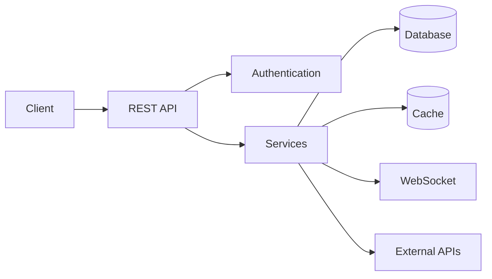

<div align="center">

# whoamicode

### Full Stack Developer • Backend Focused

Building scalable backends, APIs, automations and modern web applications.

</div>

---

## About Me

I'm a **Full Stack Developer focused on Backend Engineering**, building systems that connect solid backend architecture with functional and modern interfaces.

My main interests are **backend development, REST APIs, databases, integrations, automation and cloud infrastructure**.

I also develop complete web applications, internal dashboards, management systems and Discord-based solutions.

```ts
const whoamicode = {
  role: "Full Stack Developer",
  focus: "Backend Engineering",
  location: "Brazil",

  interests: [
    "Backend Architecture",
    "REST APIs",
    "Databases",
    "Automation",
    "Cloud Infrastructure",
    "Web Applications"
  ],

  currentlyBuilding: "SET7 Network"
};
```

---

## Tech Stack

### Backend

<p>
  
</p>

### Frontend

<p>
  
</p>

### Databases

<p>
  
</p>

### DevOps & Tools

<p>
  
</p>

---

## Backend Engineering

My primary focus is developing the infrastructure behind applications.

I work with:

* REST API development
* Authentication & authorization
* Database modeling
* Backend architecture
* Third-party integrations
* Automation systems
* Real-time applications
* WebSocket communication
* Discord integrations
* Administrative dashboards
* Application deployment
* Linux environments

---

## What I Build

```text
Backend Systems
├── REST APIs
├── Authentication
├── Database Architecture
├── Business Logic
├── Integrations
└── Automation

Web Applications
├── Frontend Interfaces
├── Administrative Dashboards
├── Management Platforms
└── Real-Time Systems

Infrastructure
├── Linux
├── Docker
├── Cloud Deployment
└── Application Monitoring
```

---

## Featured Projects

### SET7 Network

Technology ecosystem focused on creating applications, automation and digital infrastructure.

**Development areas:**

`Backend` • `Web Applications` • `Discord` • `Automation` • `APIs` • `Infrastructure`

---

### SET7 Screen

Real-time screen-sharing platform designed for secure browser-based communication.

**Technologies & concepts:**

`WebRTC` • `WebSocket` • `Node.js` • `Real-Time Communication` • `Frontend`

---

### Discord Management Systems

Backend-driven applications for community and organization management.

Features include:

`Authentication` • `Permissions` • `Automations` • `Logging` • `Database` • `Dashboards` • `API Integrations`

---

## Architecture Interests



I enjoy designing systems where each layer has a clear responsibility and can evolve independently.

---

## GitHub

<div align="center">


</div>

---

## Current Focus

```text
→ Backend Engineering
→ Node.js & TypeScript
→ API Architecture
→ Database Design
→ Real-Time Applications
→ Cloud & Linux
→ Full Stack Development
```

My goal is to continuously improve my ability to design and build **reliable, scalable and maintainable software**.

---

## Connect

<div align="center">

[](https://github.com/whoamicode)

[](https://instagram.com/tauaan.7)

</div>

---

<div align="center">

### `whoami`

**Full Stack Developer • Backend Engineering**

Building systems. Designing architecture. Shipping products.

<sub>SET7 Network • Developed by whoamicode</sub>

</div>
