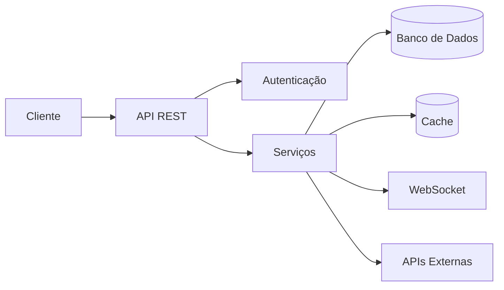

<div align="center">

# whoamicode

### Desenvolvedor Full Stack • Foco em Backend

Construindo sistemas, APIs, automações e aplicações web modernas com foco em performance, organização e escalabilidade.

</div>

---

## Sobre mim

Sou **Desenvolvedor Full Stack com foco em Backend**, atuando no desenvolvimento de sistemas que conectam uma arquitetura sólida no servidor com interfaces modernas e funcionais.

Meu principal foco está em **desenvolvimento backend, APIs REST, bancos de dados, integrações, automações e infraestrutura de aplicações**.

Também desenvolvo aplicações web completas, dashboards administrativos, sistemas de gerenciamento, integrações com serviços externos e soluções para Discord.

```ts
const whoamicode = {
  cargo: "Desenvolvedor Full Stack",
  especialidade: "Backend",
  localizacao: "Brasil",

  interesses: [
    "Arquitetura Backend",
    "APIs REST",
    "Bancos de Dados",
    "Automações",
    "Infraestrutura",
    "Aplicações Web"
  ],

  projetoAtual: "SET7 Network"
};
```

---

## Tecnologias

### Backend

<p>
  
</p>

### Frontend

<p>
  
</p>

### Banco de Dados

<p>
  
</p>

### DevOps & Ferramentas

<p>
  
</p>

---

## Engenharia Backend

Meu principal foco é desenvolver a infraestrutura e a lógica por trás das aplicações.

Trabalho com:

* Desenvolvimento de APIs REST
* Autenticação e autorização
* Modelagem de banco de dados
* Arquitetura Backend
* Integrações com APIs externas
* Sistemas de automação
* Aplicações em tempo real
* Comunicação via WebSocket
* Integrações com Discord
* Dashboards administrativos
* Deploy de aplicações
* Ambientes Linux

---

## O que eu desenvolvo

```text
Backend
├── APIs REST
├── Autenticação
├── Arquitetura de Banco de Dados
├── Regras de Negócio
├── Integrações
└── Automações

Aplicações Web
├── Interfaces Frontend
├── Dashboards Administrativos
├── Sistemas de Gerenciamento
└── Sistemas em Tempo Real

Infraestrutura
├── Linux
├── Docker
├── Cloud
└── Monitoramento de Aplicações
```

---

## Projetos em destaque

### SET7 Network

Ecossistema tecnológico voltado para desenvolvimento de aplicações, sistemas de gerenciamento, automações e infraestrutura digital.

**Áreas de desenvolvimento:**

`Backend` • `Aplicações Web` • `Discord` • `Automações` • `APIs` • `Infraestrutura`

---

### SET7 Screen

Plataforma de compartilhamento de tela em tempo real desenvolvida para comunicação segura diretamente pelo navegador.

**Tecnologias e conceitos:**

`WebRTC` • `WebSocket` • `Node.js` • `Comunicação em Tempo Real` • `Frontend`

---

### Sistemas de Gerenciamento para Discord

Aplicações orientadas a backend para gerenciamento de comunidades, organizações e operações dentro do Discord.

Recursos desenvolvidos:

`Autenticação` • `Permissões` • `Automações` • `Logs` • `Banco de Dados` • `Dashboards` • `Integrações`

---

## Arquitetura



Tenho interesse especial em desenvolver sistemas onde cada camada possui responsabilidades bem definidas, facilitando manutenção, evolução e escalabilidade.

---

## GitHub

<div align="center">


</div>

---

## Foco atual

```text
→ Engenharia Backend
→ Node.js & TypeScript
→ Arquitetura de APIs
→ Banco de Dados
→ Aplicações em Tempo Real
→ Cloud & Linux
→ Desenvolvimento Full Stack
```

Meu objetivo é evoluir continuamente no desenvolvimento de **software confiável, escalável, organizado e de fácil manutenção**.

---

## Contato

<div align="center">

[](https://github.com/whoamicode)

[![Instagram][(https://www.instagram.com/tauancode?igsi=a2oyNnYxa21taWlx&utm_source=qr)

</div>

---

<div align="center">

### `whoami`

**Desenvolvedor Full Stack • Backend**

Construindo sistemas. Projetando arquiteturas. Transformando ideias em software.

<sub>SET7 Network • Desenvolvido por whoamicode</sub>

</div>
